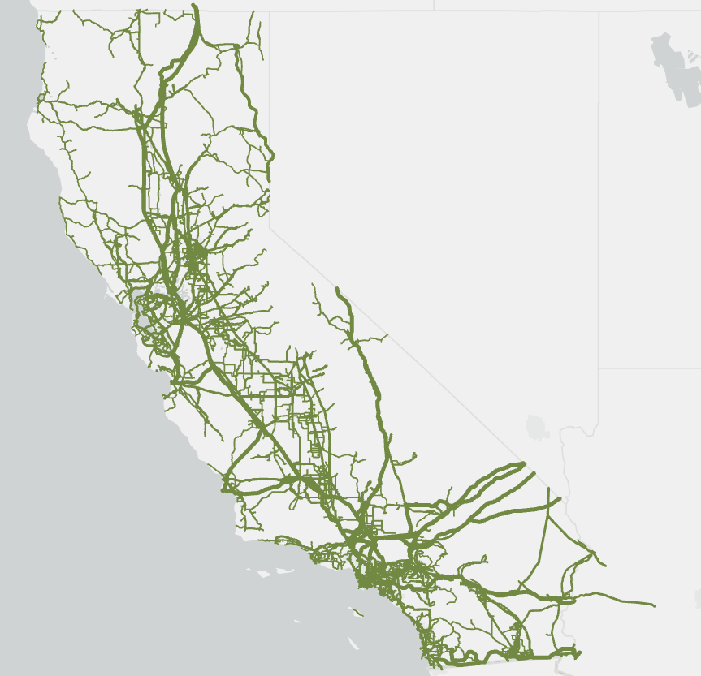

<!-- PROJECT LOGO -->
<br />
<div align="center">
  <a href="https://github.com/WISPO-POP/CATS-CaliforniaTestSystem">
    
  </a>

<h3 align="center">CATS - California Test System</h3>

  <p align="center">
    A geographically-accurate synthetic grid in California.
    <!-- <br /> -->
    <!-- <a href="https://github.com/WISPO-POP/CATS-CaliforniaTestSystem"><strong>View Documentation »</strong></a> -->
    <!-- <br /> -->
    <br />
    <a href="https://github.com/WISPO-POP/CATS-CaliforniaTestSystem/issues">Report Bug</a>
    ·
    <a href="https://github.com/WISPO-POP/CATS-CaliforniaTestSystem/issues">Request Feature</a>
  </p>
</div>


Project Link: [https://github.com/WISPO-POP/SyntheticCaliforniaGrid](https://github.com/WISPO-POP/CATS-CaliforniaTestSystem)

Time-series data (load and renewable generation) link: [https://tinyurl.com/SyntheticCaliforniaGridData](https://drive.google.com/drive/folders/1Zo6ZeZ1OSjHCOWZybbTd6PgO4DQFs8_K?usp=sharing)

## Description
This repository contains the data files the California Test System (CATS), which is a geographically-accurate, synthetic electric grid model that is located in California. This model was created using publicly available geographic data of California's actual transmission lines, substations, and power plants, which we combined with invented connections and parameters that are "realistic but not real". For more information about how this network model was created, please refer to our publication: [California Test System (CATS): A Geographically Accurate Test System based on the California Grid](https://arxiv.org/abs/2210.04351).

The grid model is available in two formats. The MATPOWER file format is suitable for electric power system simulation and optimization. The geographic information systems (GIS) files, in .GEOJSON and .CSV formats, are suitable for geospatial analyses.

We also provide the load and renewable generation profiles that we used in the creation and evaluation of this grid. Since some of these data files exceed the size limit on GitHub, they are available in a Google Drive folder at this link: [https://tinyurl.com/SyntheticCaliforniaGridData](https://drive.google.com/drive/folders/1Zo6ZeZ1OSjHCOWZybbTd6PgO4DQFs8_K?usp=sharing).

## Usage
Clone the repository
```julia
   git clone https://github.com/WISPO-POP/CATS-CaliforniaTestSystem.git
```

Run a DC optimal power flow using [PowerModels.jl](https://github.com/lanl-ansi/PowerModels.jl) by executing the file `run_opf.jl`.

### Recent Updates
The CATS was updated on November 11, 2023. All previous versions are available in the 'Archive' directory.
<!-- Due to formatting restrictions, the MATPOWER and GIS formats of the CATS model have different indices for components. The CSV files in the `Additional Data Files` folder map this relationship, in addition to providing additional data fields. 

In `branch_data.csv`, "Branch Number" is the MATPOWER index in `CaliforniaTestSystem.m`, while "FID" is the GIS index in `lines.geojson`. WARNING: There is currently an issue with the ID mapping in `branch_data.csv`. This issue should be resolved soon. Thank you for your patience.

In `bus_data.csv`, "Bus number" is the MATPOWER index in `CaliforniaTestSystem.m`, while "FID" is the GIS index in `added_nodes.geojson` and `substations.geojson`. Note: An identifier to distinguish between substations and added nodes will be added to `bus_data.csv` soon. Note: In the network creation process, not all buses are included in the largest connected grid. Therefore, there are some buses that are present in the GIS data, but are not included in the MATPOWER version of CATS.

In `gen_data.csv`, "Generator number" and "Bus number" are the MATPOWER indices in `CaliforniaTestSystem.m`, while PlantCode and GenId identify generators in `EIA_Generator_Y2019.csv`. Note: In the network creation process, not all generators are included in the largest connected grid. Therefore, there are some generators that are present in the data from the EIA-860, but are not included in the MATPOWER version of CATS. -->

<!-- ## Contents of this repository
Key files and folders of this repository are described below.

* `MATPOWER` -- folder that contains the MATPOWER version of the grid
  * `CaliforniaTestSystem.m` -- MATPOWER file of the Synthetic California Grid
* `GIS` -- folder that contains the GIS version of the grid 
  * `lines.geojson` -- GEOJSON file of the transmission lines (modified from the CEC version)
  * `substations.geojson` -- GEOJSON file of the substations (modified from the CEC version)
  * `added_nodes.geojson` -- GEOJSON file of the nodes added to the system for connectivity
  * `EIA_Generator_Y2019.csv` -- CSV files of the generators (unmodified from EIA), contains geographic coordinates
* `Additional Data Files` -- folder that contains additional component data. Includes IDs to map between GIS and MATPOWER files.
  * `branch_data.csv` -- CSV file of additional branch data
  * `bus_data.csv` -- CSV file of additional bus data
  * `gen_data.csv` -- CSV file of additional generator data
* `run_opf.jl` -- Julia script to run a DC optimal power flow analysis of the grid -->

## Citation
If you use this repository, please cite our publication:
```
@misc{CATS2022,
  doi = {10.48550/ARXIV.2210.04351},
  url = {https://arxiv.org/abs/2210.04351},
  author = {Taylor, Sofia and Rangarajan, Aditya and Rhodes, Noah and Snodgrass, Jonathan and Lesieutre, Bernie and Roald, Line A.},
  title = {California Test System (CATS): A Geographically Accurate Test System based on the California Grid},
  publisher = {arXiv},
  year = {2022},
  copyright = {arXiv.org perpetual, non-exclusive license}
}
```

<!-- LICENSE -->
<!-- ## License
UNCOMMENT THIS SECTION AND ADD LICENSE FILE IF MADE PUBLIC.
Distributed under the UW License. See `LICENSE.txt` for more information. -->

<!-- ## Contact
UNCOMMENT THIS SECTION AND ADD CONTACT DETAILS IF MADE PUBLIC.
Your Name - [@twitter_handle](https://twitter.com/twitter_handle) - email@email_client.com

Project Link: [https://github.com/github_username/repo_name](https://github.com/github_username/repo_name) -->

## Acknowledgments

The California Test System was developed by researchers at the University of Wisconsin-Madison and Texas A&M University:

* Sofia Taylor\*, UW Madison
* Aditya Rangarajan\*, UW Madison
* Noah Rhodes, UW Madison
* Jonathan Snodgrass, Texas A&M
* Bernie Lesieutre, UW Madison
* Line A. Roald, UW Madison

\* Indicates equal contribution.


This work is funded in part by the Power Systems Engineering Research Center (PSERC) through project S-91, the National Science Foundation (NSF) under Grant. No. ECCS-2045860, and the NSF Graduate Research Fellowship Program under Grant No. DGE-1747503.

<p align="right">(<a href="#top">back to top</a>)</p>
