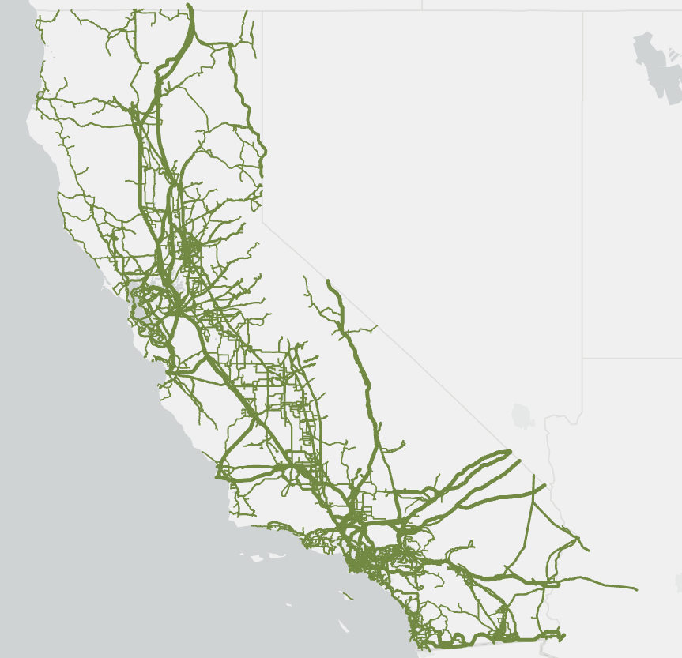

<!-- PROJECT LOGO -->
<br />
<div align="center">
  <a href="https://github.com/WISPO-POP/CATS-CaliforniaTestSystem">
    
  </a>

<h3 align="center">CATS - California Test System</h3>

  <p align="center">
    A geographically-accurate synthetic grid in California.
    <!-- <br /> -->
    <!-- <a href="https://github.com/WISPO-POP/CATS-CaliforniaTestSystem"><strong>View Documentation »</strong></a> -->
    <!-- <br /> -->
    <br />
    <a href="https://github.com/WISPO-POP/CATS-CaliforniaTestSystem/issues">Report Bug</a>
    ·
    <a href="https://github.com/WISPO-POP/CATS-CaliforniaTestSystem/issues">Request Feature</a>
  </p>
</div>


Project Link: [https://github.com/WISPO-POP/SyntheticCaliforniaGrid](https://github.com/WISPO-POP/CATS-CaliforniaTestSystem)

Time-series data (load and renewable generation) link: [https://tinyurl.com/SyntheticCaliforniaGridData](https://drive.google.com/drive/folders/1Zo6ZeZ1OSjHCOWZybbTd6PgO4DQFs8_K?usp=sharing)

## Description
This repository contains the data files the California Test System (CATS), which is a geographically-accurate, synthetic electric grid model that is located in California. This model was created using publicly available geographic data of California's actual transmission lines, substations, and power plants, which we combined with invented connections and parameters that are "realistic but not real". For more information about how this network model was created, please refer to our publication: [California Test System (CATS): A Geographically Accurate Test System based on the California Grid](https://ieeexplore.ieee.org/document/10337776).

The grid model is available in two formats. The MATPOWER file format is suitable for electric power system simulation and optimization. The geographic information systems (GIS) files, in .GEOJSON and .CSV formats, are suitable for geospatial analyses.

We also provide the load and renewable generation profiles that we used in the creation and evaluation of this grid. Since some of these data files exceed the size limit on GitHub, they are available in a Google Drive folder at this link: [https://tinyurl.com/SyntheticCaliforniaGridData](https://drive.google.com/drive/folders/1Zo6ZeZ1OSjHCOWZybbTd6PgO4DQFs8_K?usp=sharing).

## Usage
Clone the repository
```julia
   git clone https://github.com/WISPO-POP/CATS-CaliforniaTestSystem.git
```

Run a DC optimal power flow using [PowerModels.jl](https://github.com/lanl-ansi/PowerModels.jl) by executing the file `run_opf.jl`.

### Recent Updates
The CATS was updated on November 11, 2023. All previous versions are available in the 'Archive' directory.
<!-- Due to formatting restrictions, the MATPOWER and GIS formats of the CATS model have different indices for components. The CSV files in the `Additional Data Files` folder map this relationship, in addition to providing additional data fields. 

In `branch_data.csv`, "Branch Number" is the MATPOWER index in `CaliforniaTestSystem.m`, while "FID" is the GIS index in `lines.geojson`. WARNING: There is currently an issue with the ID mapping in `branch_data.csv`. This issue should be resolved soon. Thank you for your patience.

In `bus_data.csv`, "Bus number" is the MATPOWER index in `CaliforniaTestSystem.m`, while "FID" is the GIS index in `added_nodes.geojson` and `substations.geojson`. Note: An identifier to distinguish between substations and added nodes will be added to `bus_data.csv` soon. Note: In the network creation process, not all buses are included in the largest connected grid. Therefore, there are some buses that are present in the GIS data, but are not included in the MATPOWER version of CATS.

In `gen_data.csv`, "Generator number" and "Bus number" are the MATPOWER indices in `CaliforniaTestSystem.m`, while PlantCode and GenId identify generators in `EIA_Generator_Y2019.csv`. Note: In the network creation process, not all generators are included in the largest connected grid. Therefore, there are some generators that are present in the data from the EIA-860, but are not included in the MATPOWER version of CATS. -->

<!-- ## Contents of this repository
Key files and folders of this repository are described below.

* `MATPOWER` -- folder that contains the MATPOWER version of the grid
  * `CaliforniaTestSystem.m` -- MATPOWER file of the Synthetic California Grid
* `GIS` -- folder that contains the GIS version of the grid 
  * `lines.geojson` -- GEOJSON file of the transmission lines (modified from the CEC version)
  * `substations.geojson` -- GEOJSON file of the substations (modified from the CEC version)
  * `added_nodes.geojson` -- GEOJSON file of the nodes added to the system for connectivity
  * `EIA_Generator_Y2019.csv` -- CSV files of the generators (unmodified from EIA), contains geographic coordinates
* `Additional Data Files` -- folder that contains additional component data. Includes IDs to map between GIS and MATPOWER files.
  * `branch_data.csv` -- CSV file of additional branch data
  * `bus_data.csv` -- CSV file of additional bus data
  * `gen_data.csv` -- CSV file of additional generator data
* `run_opf.jl` -- Julia script to run a DC optimal power flow analysis of the grid -->

## Citation
If you use this repository, please cite our publication:
```
@article{CATS2024,
  author={Taylor, Sofia and Rangarajan, Aditya and Rhodes, Noah and Snodgrass, Jonathan and Lesieutre, Bernard C. and Roald, Line A.},
  journal={IEEE Transactions on Energy Markets, Policy and Regulation}, 
  title={California Test System (CATS): A Geographically Accurate Test System Based on the California Grid}, 
  year={2024},
  volume={2},
  number={1},
  pages={107-118},
  doi={10.1109/TEMPR.2023.3338568}
}
```

<!-- LICENSE -->
<!-- ## License
UNCOMMENT THIS SECTION AND ADD LICENSE FILE IF MADE PUBLIC.
Distributed under the UW License. See `LICENSE.txt` for more information. -->

<!-- ## Contact
UNCOMMENT THIS SECTION AND ADD CONTACT DETAILS IF MADE PUBLIC.
Your Name - [@twitter_handle](https://twitter.com/twitter_handle) - email@email_client.com

Project Link: [https://github.com/github_username/repo_name](https://github.com/github_username/repo_name) -->

## Acknowledgments

The California Test System was developed by researchers at the University of Wisconsin-Madison and Texas A&M University:

* Sofia Taylor\*, UW Madison
* Aditya Rangarajan\*, UW Madison
* Noah Rhodes, UW Madison
* Jonathan Snodgrass, Texas A&M
* Bernie Lesieutre, UW Madison
* Line A. Roald, UW Madison

\* Indicates equal contribution.


This work is funded in part by the Power Systems Engineering Research Center (PSERC) through project S-91, the National Science Foundation (NSF) under Grant. No. ECCS-2045860, and the NSF Graduate Research Fellowship Program under Grant No. DGE-1747503.

<p align="right">(<a href="#top">back to top</a>)</p>

<!-- Sections below were added on 2026-09-27. The original text above is unchanged. -->

## Repository layout

| Folder | What it contains | Main contributor (git history) | Start here |
|---|---|---|---|
| [`MATPOWER/`](MATPOWER/README.md) | Current CATS network as a MATPOWER case file: 8,870 buses, 3,892 generators, 10,823 branches | Sofia Taylor (first version of the file added by Aditya Rangarajan) | `CaliforniaTestSystem.m` |
| [`Script/`](Script/README.md) | Julia script that solves an AC optimal power flow for each hour, using hourly load and solar/wind data | Aditya Rangarajan, Dinah Shi | `test_eval.jl` |
| `GIS/` | Current GIS data. `CATS_buses.csv` and `CATS_gens.csv` have one row per MATPOWER bus and generator, in the same order, with latitude and longitude. `CATS_lines.json` is GeoJSON with one feature per branch (10,816 LineStrings and 7 MultiLineStrings). | Sofia Taylor | `CATS_buses.csv` |
| `Archive/` | The earlier CATS release (before the 2023-11-11 update): MATPOWER file, GeoJSON files of lines, substations and added nodes, CSV files that map MATPOWER indices to GIS indices, and the 2019 EIA generator list | Sofia Taylor (the three mapping CSV files were written by Aditya Rangarajan) | - |

Files at the repository root:

| File | What it is |
|---|---|
| `run_opf.jl` | Loads `MATPOWER/CaliforniaTestSystem.m` with PowerModels.jl and solves a DC optimal power flow (`DCPPowerModel`) with Ipopt |
| `logo.png` | Logo shown at the top of this README |
| `LICENSE` | BSD 3-Clause licence |

## Setup

The repository has no Julia `Project.toml`, so package versions are not pinned.

1. Install Julia 1.x from https://julialang.org/downloads/.
2. Install the packages the scripts load. From a Julia prompt:
   ```julia
   import Pkg
   Pkg.add(["PowerModels", "JuMP", "Ipopt", "CSV", "JSON", "DataFrames"])
   ```
   The Ipopt package installs the Ipopt solver itself; no separate solver install is needed.
3. `Script/test_eval.jl` also has `using Gurobi`. Add `"Gurobi"` to the list above if you run it, or see [`Script/README.md`](Script/README.md).
4. Optional: to use the case in MATLAB or GNU Octave instead of Julia, install MATPOWER (https://matpower.org) and add it to the MATLAB/Octave path.
5. For `Script/test_eval.jl` only: put the two time-series files it reads in a `data/` folder at the repository root (see [Inputs and outputs](#inputs-and-outputs)), and create an empty `Script/solutions/` folder.

All paths in the scripts are relative; there are no absolute paths to edit. `run_opf.jl` must be run from the repository root and `Script/test_eval.jl` from the `Script` folder.

## Running

DC optimal power flow of the full case, from the repository root:

```
julia run_opf.jl
```

By default `run_opf.jl` does not save the result; the console shows only the PowerModels and Ipopt log messages. Set `save_to_JSON = true` near the top of the file to write it to `pf_solution.json` in the current folder, or run the script from a Julia prompt with `include("run_opf.jl")` and then inspect `solution["termination_status"]` and `solution["objective"]`.

The same case in MATLAB or Octave with MATPOWER, from the repository root:

```matlab
addpath('MATPOWER');
mpc = loadcase('CaliforniaTestSystem');
results = rundcopf(mpc);
```

Hourly AC optimal power flow, from the `Script` folder:

```
cd Script
julia test_eval.jl
```

See [`Script/README.md`](Script/README.md) for its settings and the range of hours it solves.

## Inputs and outputs

- `MATPOWER/CaliforniaTestSystem.m` is the network input for both Julia scripts.
- `Script/test_eval.jl` also reads `GIS/CATS_gens.csv` (the `FuelType` column), `data/Load_Agg_Post_Assignment_v3_latest.csv` (hourly load at each bus) and `data/HourlyProduction2019.csv` (hourly `Solar` and `Wind` totals). The two `data/` files are not in the repository; `data/` is listed in `.gitignore`. The Google Drive folder linked above holds the load and renewable generation profiles; the script expects the file names given here.
- `run_opf.jl` writes `pf_solution.json` only when `save_to_JSON = true`.
- `Script/test_eval.jl` writes, inside `Script/`, one `solutions/solution_<hour>.json` file per hour solved and `termination_status_ACOPF_corrected_cc.txt` with the solver status of each hour.

## Known issues

- `Script/test_eval.jl` needs two data files that are not in the repository (see above).
- As committed, `Script/test_eval.jl` solves only hours 8649 to 8760 (`for k = 8649:N`). Change the loop start to `1` for the full year.
- `Script/test_eval.jl` loads Gurobi.jl (`using Gurobi, Ipopt`) although the active solver is Ipopt, so it stops at that line if Gurobi.jl is not installed.
- `Script/test_eval.jl` writes to `Script/solutions/` by default but does not create that folder.

Details and the remaining script issues are in [`Script/README.md`](Script/README.md).

## Contributors

From the git history:

- Sofia Taylor: 26 commits (15 as "Sofia Taylor", 11 as "Sofia-Taylor")
- Aditya Rangarajan: 8 commits
- Dinah Shi: 2 commits

## Status

- First commit 2022-08-26; last code commit 2024-02-28 (the MATPOWER case). The README citation was last updated on 2024-03-27.
- The network model was replaced on 2023-11-11 (commit "CATS update (v2)") and the earlier files moved to `Archive/`. The current `GIS/` files were last changed on 2023-11-15 (`CATS_lines.json`) and 2023-12-12 (the two CSV files). The MATPOWER case was last changed on 2024-02-28, when its function was renamed to `CaliforniaTestSystem`.
- `Script/` was added on 2024-02-07 and last changed on 2024-02-21. `run_opf.jl` was last changed on 2022-10-04.
